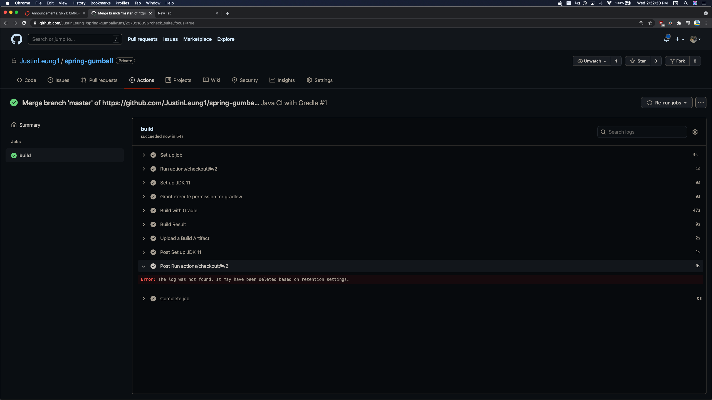
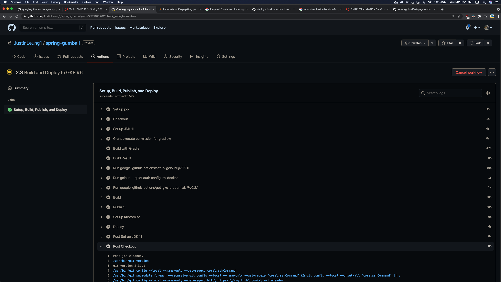
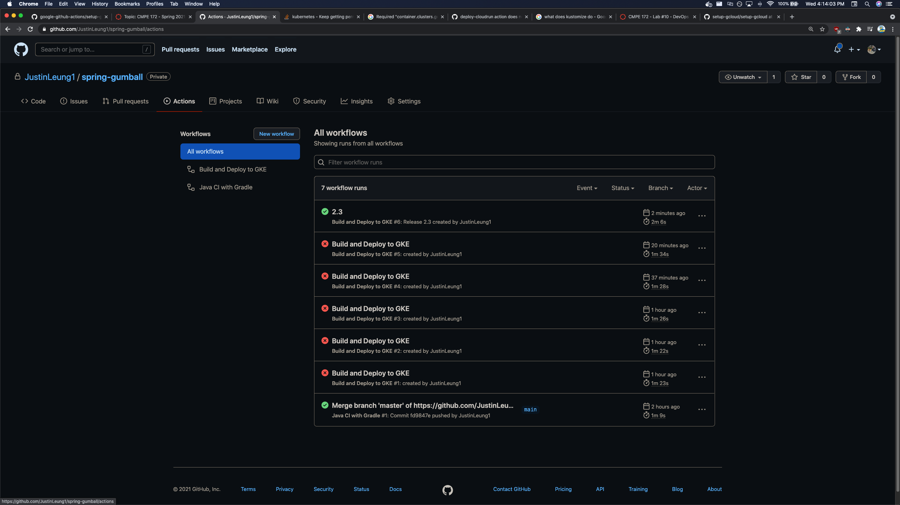
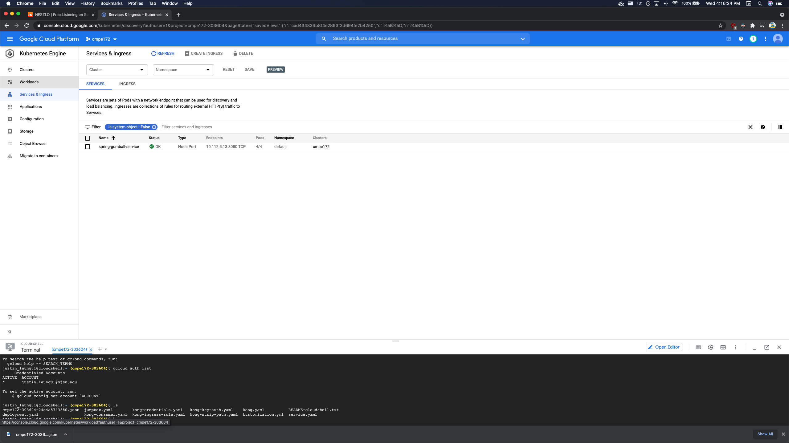
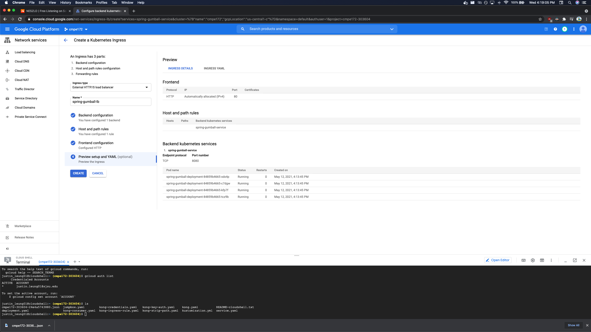
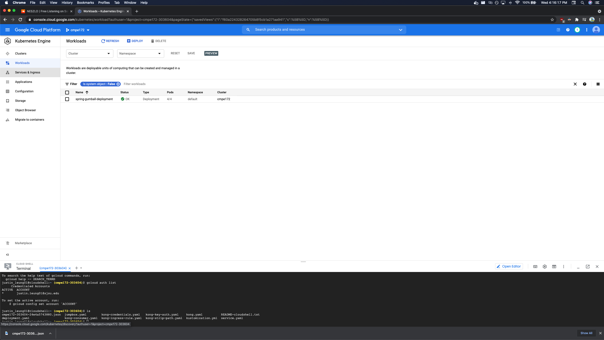
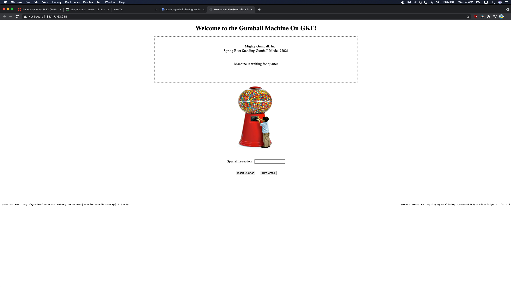

# spring-gumball ci/cd example

### I ran into a lot of issues when setting up k8 cluster because I attempted before the video was released but I eventually got everything working. I had to redo my cluster multiple times, but it finally started working. 

## CI Workflow Part 1 - Gradle

----

## CI Workflow Part 1 - GKE

### Google Pipeline - Dashboard

### Google Pipeline - Worked!

### Google Pipeline - Service

### Google Pipeline - Ingress

### Google Pipeline - Workload

### Google Pipeline - Gumball
